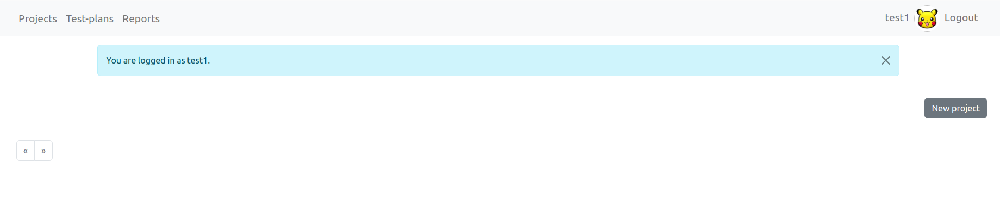
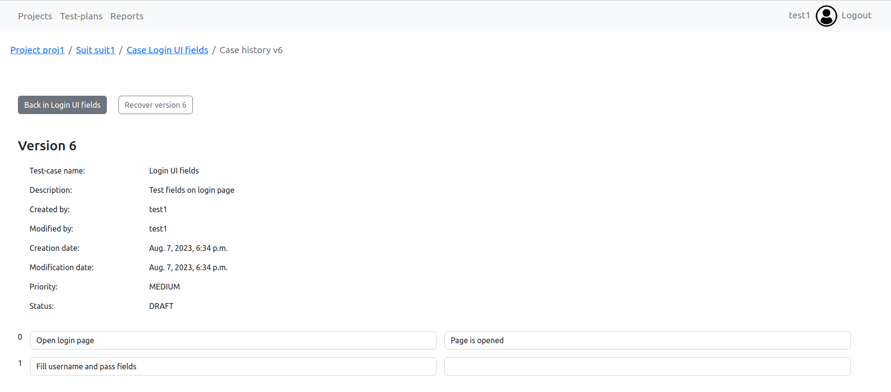

# Tutorial
Open in browser http://127.0.0.1:8000

### Create User
Click to button `Sign up` and fill all necessary fields.

Log in system.

### Create Project

`Projects` in header redirect to list with all projects.

Create new project.

### Create Suit
Click on project and view page with suits.

Create new suit.

### Create Test-case
Click on suit and view page with test-cases

Create new test-case.

Any version of case can be restored. Click to button `Show history`.

View it and recover if it's necessary.

### Create Test-plan
`Test-plans` in header redirect to list with all test-plans.

Create new test-plan.

Choose project for test-plan.

Choose suit and test-cases.

### Create Report
`Reports` in header redirect to list with all reports.
Create new test-plan.

Add plan to report.

View report.

